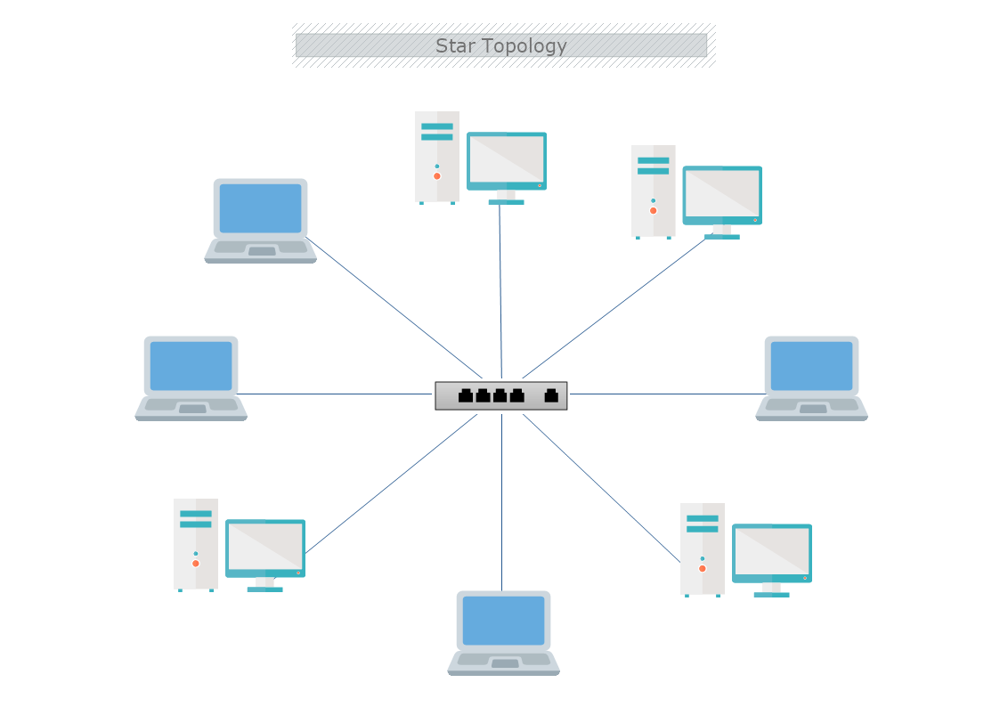
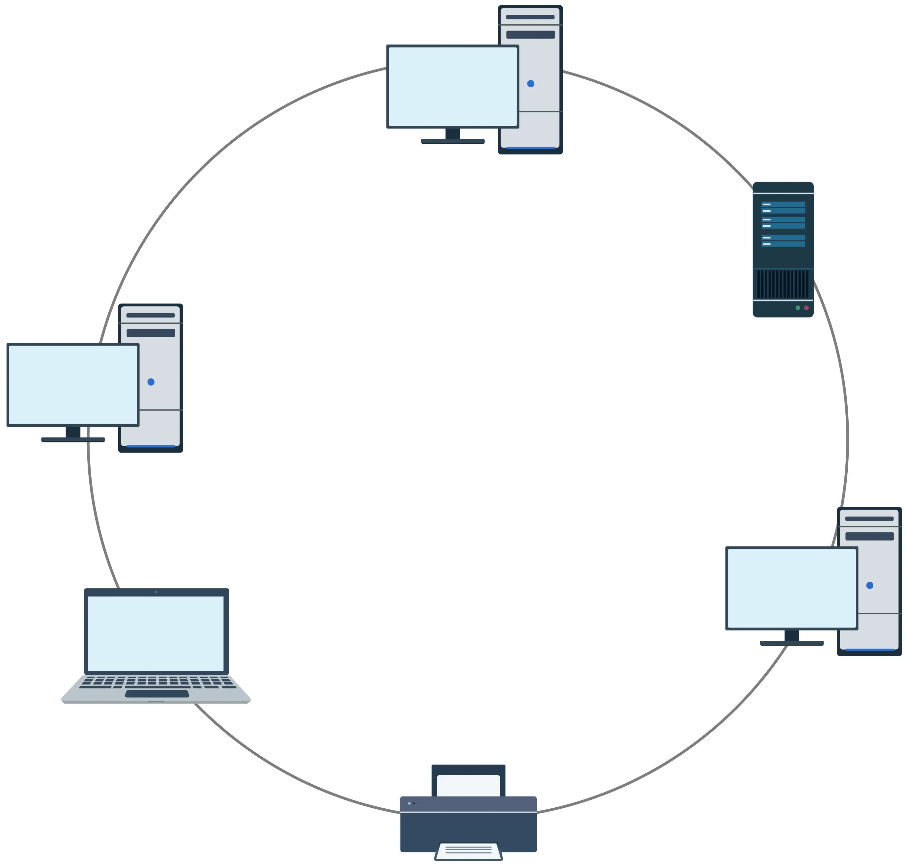
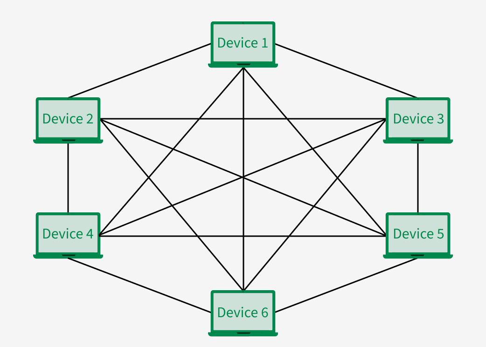

# 02 - Network Topologies & Data Transmission Fundamentals

### 1. أنواع وتدفق إرسال البيانات (Data Transmission Types)

* **Unicast:**
  * إرسال البيانات من جهاز مصدر واحد محدد إلى جهاز هدف واحد محدد (`One-to-One`).
  * يتم عبر وضع عنوان الهدف الفردي في خانة `Destination Address`.

* **Broadcast:**
  * إرسال البيانات من جهاز واحد ليصل إلى جميع الأجهزة الموجودة داخل نطاق الشبكة المحلية (`One-to-All`).
  * يستخدم عناوين بث مخصصة مثل `FF:FF:FF:FF:FF:FF` على مستوى طبقة ربط البيانات `Layer 2`.
  * استخدامه المفرط يعتبر عملية مزعجة تسبب بطء الشبكة واستهلاكاً ملحوظاً لموارد معالجة الأجهزة، ولذلك يجب التخلص منها أو تقليلها قدر الإمكان.

* **Multicast:**
  * إرسال البيانات من جهاز واحد إلى مجموعة أجهزة محددة مهتمة بخدمة معينة فقط (`One-to-Many`).
  * من أمثلته البث المباشر للفيديو ورسائل تحديث بروتوكولات التوجيه مثل بروتوكول `OSPF`.

* **Anycast:**
  * إرسال البيانات من جهاز إلى أقرب جهاز متاح من ضمن مجموعة أجهزة تقدم نفس الخدمة، وذلك بناءً على قواعد التوجيه والمسافة الأقصر.

---

### 2. بنية العنوان الفيزيائي (MAC Address Architecture)

* **التعريف والمفهوم:**
  * يطلق عليه `Physical Address` أو `Hardware Address` أو `Burned-In Address (BIA)`.
  * وفي بعض المصادر يسمى `CAM - Content Addressable Memory` أو `EUI-48 Standard`.
  * هو عنوان فيزيائي فريد عالمياً يتم حرقه على بطاقة الشبكة `NIC` داخل المصنع ولا يتكرر لأي جهاز في العالم.

* **البنية والتركيب:**
  * يتكون العنوان من مساحة إجمالية قدرها `48 Bits` (تعادل `6 Bytes`).
  * يكتب بنظام العد الست عشري `Hexadecimal` المكون من 12 خانة (أرقام من `0` إلى `9` وحروف من `A` إلى `F`).
  * يُمثل في 6 أجزاء (`6 Octets`)، كل جزء عبارة عن `8 Bits`.

* **أقسام الـ MAC Address:**
  * **OUI (`Organizationally Unique Identifier`):**
    * يمثل النصف الأول من العنوان بمقدار أول `24 Bits` (تعادل أول 6 خانات `Hex`).
    * كود مخصص تمنحه منظمة `IEEE` للشركة المصنعة للبطاقة مثل `Cisco` أو `Dell` أو `Intel`.
  * **Vendor Assigned (`Device ID / NIC Serial`):**
    * يمثل النصف الثاني من العنوان بمقدار آخر `24 Bits` (تعادل آخر 6 خانات `Hex`).
    * الرقم التسلسلي التعريفي الخاص بكل بطاقة شبكة تصنعها تلك الشركة.

---

### 3. مقارنة أجهزة الربط الشبكي (Network Interconnection Devices)

* **Repeater:**
  * يعمل في الطبقة الأولى `Layer 1 (Physical Layer)`.
  * وظيفته استقبال الإشارات الكهربائية الضعيفة وإعادة توليدها وتقويتها لتجاوز الحد الأقصى لمسافة الكابل دون فحص محتوى البيانات.

* **Hub:**
  * جهاز مكرر متعدد المنافذ `Multi-port Repeater` يعمل في الطبقة الأولى `Layer 1`.
  * لا يفهم عناوين الماك `MAC Address` إطلاقاً؛ أي إشارة يستقبلها على منفذ ينسخها ويعمل لها `Flood` فوراً إلى جميع المنافذ الأخرى دون تمييز (`Dummy Device`).
  * يعمل بنمط الإرسال نصف المزدوج `Half-Duplex`، مما يجعله نطاق تصادم واحد لجميع الأجهزة.

* **Bridge:**
  * يعمل في الطبقة الثانية `Layer 2 (Data Link Layer)`.
  * يستطيع قراءة وفهم الـ `MAC Address`، ويقوم بتقسيم الشبكة إلى نطاقي تصادم منفصلين لتقليل الزحام، لكنه محدود المنافذ وبطيء في المعالجة مقارنة بالسويتش.

* **Switch:**
  * يعمل أساساً في الطبقة الثانية `Layer 2`، ويعتبر بمثابة `Multi-port Bridge` عالي السرعة والكفاءة.
  * يعتمد على دوائر عتادية مخصصة `ASIC Chips` لمعالجة وتمرير الفريمات بسرعات عالية جداً.
  * يبني ويحدّث جدولاً داخلياً يسمى `MAC Address Table` داخل الرامات (`RAM`) لربط كل جهاز بالمنفذ الفعلي المتصل به.
  * يقوم السويتش بتسجيل عنوان الـ MAC الخاص بالجهاز في حالة واحدة فقط؛ وهي عندما يقوم الجهاز بإرسال بيانات تمر عبر السويتش. غير ذلك، يعتبر الجهاز وعنوانه مجهولين بالنسبة للسويتش.
  * يظل العنوان مخزناً لمدة 300 ثانية (تُعرف بالـ `Aging Time`) وبعدها يُمحى إذا لم يحدث اتصال.
  * يعمل بنمط الإرسال المزدوج الكامل `Full-Duplex` (إرسال واستقبال في نفس اللحظة)؛ حيث يخزن البيانات في `Buffer` قبل إرسالها مما يقضي على التصادم افتراضياً.
  * يقوم بعمل `Flood` لأول فريم فقط (أو لرسائل الـ Broadcast)، وبمجرد تعلمه للماك، يحول الإرسال إلى نمط `Unicast` مباشر.

* **Router:**
  * يعمل في الطبقة الثالثة `Layer 3 (Network Layer)`.
  * وظيفته ربط الشبكات المختلفة وتوجيه الحزم بالاعتماد على العناوين المنطقية `Logical IP Address` وجدول التوجيه `Routing Table`.

---

### 4. نطاقات التصادم والبث (Collision vs Broadcast Domains)

* **Collision Domain (نطاق التصادم):**
  * هو مجموعة الأجهزة التي لو أرسل اثنان منها بيانات في نفس اللحظة، ستتصادم البيانات وتتلف الإشارات. يحدث ذلك عندما تحاول الأجهزة التحدث على نفس القناة أو السلك في وقت واحد.
  * **تأثير الأجهزة:**
    * جهاز الـ `Hub` يمثل نطاق تصادم واحد (`1 Collision Domain`) لجميع المنافذ المتصلة به، حيث يرسل البيانات على كل الأسلاك في وقت واحد.
    * جهاز الـ `Switch` يفصل كل منفذ من منافذه داخل نطاق تصادم مستقل تماماً (`Number of Interfaces = Collision Domains`) لأنه يعتمد على توجيه `Unicast` وتخزين `Buffer`.
    * جهاز الـ `Router` يفصل كل منفذ من منافذه داخل نطاق تصادم مستقل تماماً (`Number of Interfaces = Collision Domains`).

* **Broadcast Domain (نطاق البث):**
  * هو النطاق أو المساحة الشبكية التي يصل إليها و"يسمعها" رسالة البث العام (`Broadcast Message`). عندما يرسل جهاز رسالة يسأل فيها "مين عنده العنوان ده؟"، كل الأجهزة في هذا النطاق تستقبل الرسالة.
  * إذا كان النطاق كبيراً جداً، تتباطأ الشبكة لأن كل جهاز سيضطر لمعالجة والرد على كل رسائل الـ Broadcast.
  * **تأثير الأجهزة:**
    * جهاز الـ `Hub` وجهاز الـ `Switch` يمرران رسائل البث العام ولا يفصلانها. (السويتش يمثل نطاق بث واحد `1 Broadcast Domain` ما لم يُقسّم عبر الـ `VLANs`).
    * جهاز الـ `Router` هو الجهاز الوحيد الذي يفصل ويقسم الـ Broadcast Domains؛ فهو يمنع عبور رسائل الـ Broadcast من شبكة لأخرى (`Number of Interfaces = Broadcast Domains`).

---

### 5. تخطيطات وهيكلة الشبكات (Network Topologies)
تُقسّم هياكل الشبكات إلى مستويين:
* **Physical Topology:** تصف المسار المادي الفعلي للأجهزة والكابلات.
* **Logical Topology:** تصف المسار البرمجي لتدفق البيانات بغض النظر عن الشكل المادي.

**1. Bus Topology:**
* تعتمد على كابل محوري رئيسي `Backbone` تتصل به كافة الأجهزة عبر موصلات فرعية.
* يتواجد مقاوم إنهاء طرفي `Terminal / Terminator` في نهاية الكابل لمنع ارتداد البيانات (`Loop`).
* **العيوب:** 
  * وجود نقطة انهيار مفردة `Single Point of Failure`؛ احتراق جهاز أو فصل كابل يوقف الشبكة.
  * نظام النقل هو `One send & All Receive` مما يسبب التصادم.
* لمعالجة مشكلة التصادم، تُستخدم تقنية **CSMA/CD** (`Carrier Sense Multiple Access / Collision Detection`):
  1. يقوم الجهاز بالاستماع للكابل (`Carrier Sense - CS`)، فإذا كان خالياً يرسل البيانات.
  2. إذا أرسل جهازان معاً يحدث تصادم `Collision`.
  3. يكتشف الجهازان التصادم، فيتوقفان عن الإرسال ويطلقان إشارة `Jam Signal` لتنبيه باقي الأجهزة.
  4. يُولد كل جهاز وقتاً عشوائياً `Random Time` للانتظار قبل إعادة الإرسال.
* تصنيفها: **Physical: Bus** و **Logical: Bus**.

**2. Star Topology:**
* النمط الأشيع حالياً؛ كل جهاز متصل بكابل مستقل بجهاز تحكم مركزي `Central Device` سواء كان `Hub` أو `Switch`.
* المزايا: سهولة عزل الأعطال والتوسعة دون التأثير على عمل باقي الأجهزة.
* تصنيفها: 
  * إذا كان الجهاز المركزي `Hub`: تصبح **Physical: Star** ولكنها **Logical: Bus** (لأنها تستخدم الـ CSMA/CD وتتأثر بالتصادم).
  * إذا كان الجهاز المركزي `Switch`: تصبح **Physical: Star** و **Logical: Star**.

  

**3. Ring Topology:**
* تتصل الأجهزة في شكل حلقة دائرية مغلقة؛ يمر مسار البيانات في اتجاه واحد من جهاز إلى الذي يليه.
* يتطلب كل جهاز بطاقتي شبكة `NIC`.
* مشكلتها الأساسية البطء، وتعطل جهاز يقطع الحلقة بالكامل. لها اسم آخر في شبكات الألياف وهو `FDDI`.
* تصنيفها: **Physical: Ring** و **Logical: Ring**.

  

**4. Mesh Topology:**
* **Full Mesh:** اتصال مباشر بين كل جهاز وكل الأجهزة الأخرى في الشبكة. تُستخدم غالباً لتوصيل السويتشات ببعضها لتوفير أعلى مستويات التوافرية `High Availability` ومسارات بديلة وتكرارية `Redundant Topology`.
* **Partial Mesh:** ربط الأجهزة والمواقع الهامة فقط بمسارات تكرارية، لتقليل التكلفة الهائلة للكابلات التي تتطلبها الـ Full Mesh.

  

**5. Point-to-Point (P2P) & Point-to-Multipoint (P2MP):**
* **Point-to-Point:** ربط مباشر ومخصص بين نقطتين طرفيتين فقط (مثل روابط شبكات الـ `WAN` والخطوط المؤجرة `Leased Lines`).
* **Point-to-Multipoint:** محطة بث رئيسية واحدة تتصل بعدة مواقع فرعية عبر واجهة مركزية واحدة.

---

### 6. التصميم الهرمي لشبكات المؤسسات (Cisco Hierarchical Model)

* **Three-Tier Architecture:**
  * **Access Layer:** طبقة ربط المستخدمين والأجهزة الطرفية وتطبيق سياسات حماية المنافذ مثل `Port Security` وعزل الشبكات عبر `VLANs`.
  * **Distribution Layer:** مسؤولة عن التوجيه بين الشبكات الافتراضية `Inter-VLAN Routing`، وتطبيق قوائم التحكم في الوصول `ACLs` وسياسات جودة الخدمة `QoS`.
  * **Core Layer:** العمود الفقري للشبكة `High-Speed Backbone`، مخصص للنقل السريع جداً للبيانات بأقل نسبة تأخير `Low Latency` دون التدخل في عمليات الفلترة المعقدة.

* **Two-Tier Architecture (Collapsed Core):**
  * دمج طبقة الـ `Core` مع طبقة الـ `Distribution` في طبقة مدمجة واحدة تسمى `Collapsed Core Layer` لتقليل تكلفة الأجهزة في الشبكات الصغيرة والمتوسطة.