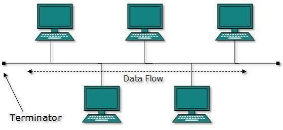

# 02 - Network Topologies & Data Transmission Fundamentals

### 1. أنواع وتدفق إرسال البيانات (Data Transmission Types)

* **Unicast (واحد إلى واحد):**
  * إرسال البيانات من جهاز مصدر واحد محدد إلى جهاز هدف واحد محدد (`One-to-One`).
  * يتم عبر وضع عنوان الهدف الفردي في خانة الـ Destination.

* **Broadcast (واحد إلى الكل):**
  * إرسال البيانات من جهاز واحد ليصل إلى جميع الأجهزة الموجودة داخل نفس نطاق الشبكة المحلية (`One-to-All`).
  * يستخدم عناوين بث خاصة (مثل `FF:FF:FF:FF:FF:FF` على مستوى Layer 2).
  * استخدامه المفرط يسبب بطء واستهلاكاً كبيراً لموارد المعالجة في الأجهزة.

* **Multicast (واحد إلى مجموعة محددة):**
  * إرسال البيانات من جهاز واحد إلى مجموعة أجهزة مهتمة بخدمة معينة فقط وليس للجميع (`One-to-Many`).
  * مثل بث الفيديو المباشر أو رسائل بروتوكولات التوجيه (مثل تحديثات OSPF).

---

### 2. العنوان الفيزيائي (MAC Address Architecture)

* **التعريف والمفهوم:**
  * يسمى `Physical Address` أو `Hardware Address` أو `Burned-In Address (BIA)`.
  * عنوان فيزيائي فريد عالمياً يتم حرقه على كارت الشبكة (`NIC`) داخل المصنع ولا يتكرر لأي جهاز في العالم.
* **البنية والتركيب:**
  * يتكون من **48 Bits** (تعادل **6 Bytes**).
  * يكتب بنظام العد الست عشري (**Hexadecimal**) المكون من 12 خانة (أرقام من 0 إلى 9 وحروف من A إلى F).
* **أقسام الـ MAC Address:**
  * **OUI (Organizationally Unique Identifier):** النصف الأول (أول 24 بت / 6 خانات Hex)، وهو كود تمنحه منظمة IEEE للشركة المصنعة للكارت (مثل Cisco أو Dell أو Intel).
  * **Vendor Assigned / NIC Serial:** النصف الثاني (آخر 24 بت / 6 خانات Hex)، وهو الرقم التسلسلي الخاص بكل كارت تنتجه تلك الشركة.

---

### 3. مقارنة أجهزة الربط الشبكي (Network Interconnection Devices)

* **Repeater :**
  * يعمل في Layer 1 (Physical Layer).
  * وظيفته استقبال الإشارة الكهربائية الضعيفة وإعادة توليدها وتقويتها لتجاوز حد أقصى لمسافة الكابل دون فحص محتوى البيانات.

* **Hub :**
  * جهاز Multi-port Repeater يعمل في Layer 1.
  * لا يفهم الـ MAC Address إطلاقاً؛ أي إشارة يستقبلها على منفذ يقوم بنسخها وإرسالها لجميع المنافذ الأخرى دون تمييز (Dummy Device).
  * يعمل بنظام Half-Duplex، مما يجعله نطاق تصادم هائل للبيانات.

* **Bridge :**
  * يعمل في Layer 2 (Data Link Layer).
  * يفهم الـ MAC Address، ويفصل الشبكة إلى نطاقي تصادم منفصلين لتقليل الزحام، لكنه محدود المنافذ وبطيء المعالجة مقارنة بالسويتش.

* **Switch :**
  * يعمل أساساً في Layer 2، ويعتبر Multi-port Bridge متطور وسريع.
  * يعتمد على الـ Hardware (ASIC Chips) لمعالجة وتمرير الفريمات بسرعات عالية.
  * يبني جدولاً يسمى `MAC Address Table` لربط كل جهاز بالمنفذ المتصل به، مما يحول الإرسال إلى Unicast مباشر ويمنع التصادم.
  * يعمل بنظام Full-Duplex (إرسال واستقبال في نفس اللحظة).

* **Router :**
  * يعمل في Layer 3 (Network Layer).
  * وظيفته ربط الشبكات المختلفة وتمرير الحزم بناءً على الـ Logical IP Address وجدول التوجيه (Routing Table).

---

### 4. نطاقات التصادم والبث (Collision vs Broadcast Domains)

* **Collision Domain :**
  * المساحة الشبكية التي إذا أرسل فيها جهازان بيانات في نفس اللحظة يحدث تصادم (Collision) وتتلف الإشارات.
  * الـ Hub يمثل Collision Domain واحد لجميع منافذه.
  * الـ Switch يفصل كل منفذ في Collision Domain مستقل تماماً.
  * الـ Router يفصل كل منفذ في Collision Domain مستقل.

* **Broadcast Domain :**
  * النطاق الذي تصل إليه رسالة الـ Broadcast إذا أطلقها أي جهاز.
  * الـ Hub والـ Switch يمرران الـ Broadcast ولا يقومان بإيقافه (السويتش كاملاً افتراضياً يمثل Broadcast Domain واحد ما لم تقسمه إلى VLANs).
  * **الراوتر هو الجهاز الوحيد الذي يكسر ويمنع عبور رسائل الـ Broadcast عبر منافذه**، فكل منفذ راوتر يمثل Broadcast Domain مستقلاً ومنفصلاً تماماً.

---

### 5. Network Topologies 

**1. Bus Topology:**
* كابل محوري رئيسي (Backbone) تتصل به كافة الأجهزة عبر موصلات T-Connectors ومقاومات طرفية (Terminators).
* عيوبه: نقطة انهيار مفردة (SPOF)، ونطاق تصادم واحد يجمع كل الأجهزة.

  

---

**2. Ring Topology:**
* تتصل الأجهزة في حلقة دائرية مغلقة عبر تداول حزمة الـ Token (Token Ring).
* عيوبه: تعطل جهاز أو سلك واحد يقطع الحلقة بالكامل، وتمت معالجتها لاحقاً بتقنية Dual-Ring للاحتياط.

  

---

**3. Star Topology:**
* كل جهاز متصل بكابل مستقل بجهاز مركزي (Switch).
* المزايا: سهولة عزل المشاكل، التوسعة السهلة، وثبات الشبكة حال انقطاع كابل جهاز فرعي.

  

---

**4. Mesh Topology:**
* **Full Mesh:** اتصال مباشر بين كل جهاز وكافة الأجهزة الأخرى عبر خطوط مخصصة (`[N * (N - 1)] / 2`). أعلى درجات التكرارية (Redundancy) وأعلاها تكلفة.
* **Partial Mesh:** ربط تكراري بين النقاط الحساسة فقط لتقليل التكلفة.

  

---

**5. Point-to-Point (P2P) & Point-to-Multipoint (P2MP):**
* **Point-to-Point:** ربط مباشر ومخصص بين نقطتين طرفيتين فقط (مثل روابط الـ WAN وخطوط Leased Lines).
* **Point-to-Multipoint:** جهاز أو محطة بث مركزية تتصل بعدة مواقع وفروع عبر قناة أو واجهة واحدة.

---

### 6. التصميم الهرمي لشبكات المؤسسات (Cisco Hierarchical Model)

* **Three-Tier Architecture:**
  * **Access Layer:** توصيل الأجهزة الطرفية وتطبيق سياسات الحماية وعزل المنافذ (Port Security & VLANs).
  * **Distribution Layer:** التوجيه بين الشبكات (Inter-VLAN Routing) وتطبيق سياسات الفلترة وقوائم ACLs والـ QoS.
  * **Core Layer:** العمود الفقري للشبكة (High-Speed Backbone)، مخصص للنقل السريع لحزم البيانات بأقل تأخير (Low Latency) دون استهلاك المعالجة في الفلترة.

* **Two-Tier Architecture (Collapsed Core):**
  * دمج طبقة الـ Core وطبقة الـ Distribution في طبقة واحدة موحدة لتقليل التكلفة في المؤسسات الصغيرة والمتوسطة.