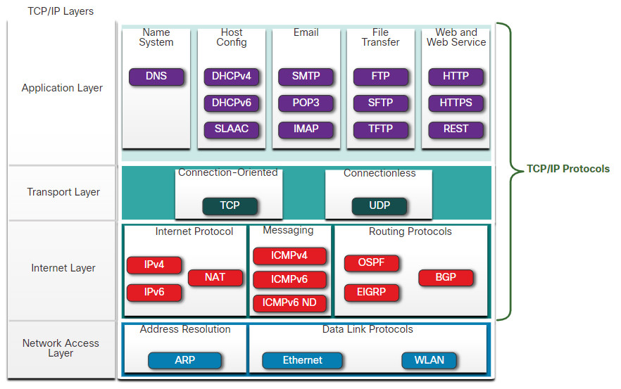
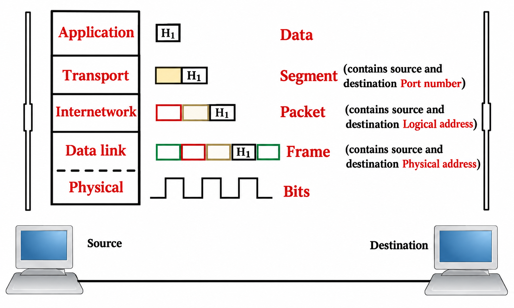

# 03 - OSI Reference Model & TCP/IP Protocol Suite

### 1. مفهوم البروتوكول والحاجة التاريخية للمعيار (Standardization)
* **تعريف البروتوكول:** لغة التخاطب والقواعد الموحدة التي تتيح لأجهزة الكمبيوتر فهم بعضها البعض عبر الشبكة.
* **الوضع قبل المعايير الموحدة:** كانت كل شركة تصنع بروتوكولاً خاصاً يعمل فقط على أجهزتها:
  * شركة `IBM` عام 1974 أنتجت بروتوكول `SNA` (Systems Network Architecture).
  * شركة `Apple` أنتجت بروتوكول `AppleTalk`.
  * شركة `Novell` أنتجت بروتوكول `IPX/SPX`.
  * النتيجة: أجهزة IBM لا تتواصل مع أجهزة Apple أو Novell، مما استدعى وجود معيار عالمي مفتوح وموحد لتتواصل الأنظمة المختلفة (مثل تصفح هاتف أندرويد لموقع مبني على سيرفر لينكس أو ويندوز).
* **مؤسسات المعايير القياسية (Standards Organizations):**
  تهدف إلى توحيد معايير الشبكات لتشجيع التوافقية (`Interoperability`)، المنافسة (`Competition`)، والابتكار (`Innovation`) دون الانحياز لشركة معينة (`Vendor-Neutral`). من أبرزها:
  * `ISOC` (Internet Society): مختصة بكل ما يخص إنشاء وتطوير شبكة الإنترنت وبروتوكولاتها.
  * `ICANN`: مختصة بتوزيع عناوين الـ IP وأسماء النطاقات.
  * `IEEE`: مسؤولة عن معايير مثل Ethernet (`802.3`) و Wi-Fi (`802.11`).
  * `ITU`: منظمة دولية تحدد معايير الاتصالات عالمياً.
  * `ISO`: المنظمة التي قامت بتطوير نموذج الـ `OSI`.

---

### 2. التسلسل التاريخي لظهور نماذج الشبكات (Model Evolution)
1. **نموذج وزارة الدفاع الأمريكية الأول (`DoD Model`):**
   * ظهر عبر وكالة `DARPA` لربط أجهزة الـ Mainframe الكبيرة بين الجامعات ومراكز الأبحاث في ولايات متباعدة عبر شبكة `ARPANET`.
2. **ظهور نموذج OSI من منظمة ISO:**
   * تم إنشاؤه كنموذج معياري مفتوح (`Open Systems Interconnection`) يتكون من 7 طبقات (`7 Layers`).
   * كلمة `Open` تعني أن الكود البرمجي والمعيار متاح ومفتوح لأي شركة لتطويره وتعديله ليعمل على معالجات أجهزتها.
   * العيب الذي منع انتشاره عملياً: الاعتماد على نظام عنونة معقد يسمى `CLNS` (عناوينه تتراوح بين 6 إلى 20 خانة Hex)، وصعوبة تطبيقه مقارنة بالـ IP العشري البسيط المكون من 4 خانات في ذلك الوقت.
3. **تطوير واستقرار TCP/IP:**
   * تم تحديث وإصلاح مشاكل نموذج `DoD` ليصبح نموذج `TCP/IP` المعتمد رسمياً والوحيد العامل على الإنترنت والشبكات في العالم.
   * نموذج `OSI` لم يعد موجوداً كبرمجيات فعلية على الأجهزة، لكنه يظل النموذج النظري المرجعي الأهم في دراسة الشبكات وتحديد المشاكل وحلها (`Troubleshooting`).

---

### 3. بنية نموذج OSI وقواعد التفاعل (Layers Interaction)
* يتكون من 7 طبقات ترقم دائماً من الأسفل إلى الأعلى:
  * الطبقة 1: `Physical`
  * الطبقة 2: `Data Link`
  * الطبقة 3: `Network`
  * الطبقة 4: `Transport`
  * الطبقة 5: `Session`
  * الطبقة 6: `Presentation`
  * الطبقة 7: `Application`
* جملة مساعدة للحفظ من أسفل لأعلى: `Please Do Not Throw Sausage Pizza Away`
* **Adjacent-Layer Interaction:** كل طبقة تستلم البيانات من الطبقة المجاورة لها (أعلى أو أسفل على نفس الجهاز)، تنفذ عملياتها، ثم تمررها للطبقة التالية.
* **Same-Layer Interaction:** كل طبقة في جهاز المصدر تتفاعل وتتفاهم مع الطبقة المماثلة لها تماماً في الجهاز المستلم عبر معلومات تضاف في الترويسة (`Header`).
* **تصنيف الطبقات ومستوى معالجة الأجهزة:**
  * **Upper Layers (الطبقات 7، 6، 5):** تدار بالكامل عبر نظام التشغيل والبرامج (`OS & Software`).
  * **Lower Layers (الطبقات 4، 3، 2، 1):** مسؤولة عن تدفق ونقل البيانات والبنية التحتية (`Network Infrastructure`)، وهي اختصاص مهندسي الشبكات وسيسكو.
  * **قاعدة هامة:** عندما نقول أن جهازاً يعمل في `Layer` معينة (مثل الراوتر `Layer 3 Device` أو السويتش `Layer 2 Device`)، فهذا يعني أن الجهاز يفهم تلك الطبقة ويستطيع معالجة جميع الطبقات التي تقع أسفلها أيضاً.

---

### 4. شرح وظائف طبقات OSI السبع بالتفصيل

#### Layer 7: Application Layer
* ليست برامج تحرير النصوص المحلية (مثل Word أو Notepad)، بل البرمجيات والخدمات التي تتطلب استخدام الشبكة أو الإنترنت لتوفير الخدمة كالتصفح (Browsing) أو تحميل الملفات (Download).
* أول نقطة تواصل وتفاعل مباشر مع المستخدم النهائي (`User Interface`) على جهاز الإرسال، وآخر طبقة تصل إليها البيانات عند الاستقبال.

#### Layer 6: Presentation Layer
* **تحديد هيئة ونوع البيانات (`Data Format`):** وضع علامات تعريفية في الترويسة لتمييز نوع الملف (مثل `ASCII` للـ Text، و `JPEG/GIF` للصور، و `MP4/AVI` للفيديو، و `MP3` للصوت) لأن الأنظمة مثل لينكس لا تعتمد بالضرورة على الامتداد الظاهري للملف بل تقرأ تركيبه الداخلي من خلال عملية التشفير الخاصة بالعرض `Encoding`.
* **الضغط وفك الضغط (`Compression & Decompression`):** ضغط البيانات المنقولة أثناء الخروج لتوفير استهلاك الباندويث وسرعة النقل، وإعادة فكها عند المستلم.
* **التشفير وفك التشفير (`Encryption & Decryption`):** تحويل النصوص والبيانات إلى نصوص مشفرة غير مفهومة على كابل الشبكة وتفكيكها عند الطرف المعتمد.

#### Layer 5: Session Layer
* مسؤولة عن إدارة جلسات العمل بين الأجهزة عبر ثلاث مراحل:
  1. **Establishment:** التفاوض بين الجهازين وحجز الموارد اللازمة للجلسة وتحديد عددها.
  2. **Maintenance:** الحفاظ على بقاء الجلسة مفتوحة ونشطة طوال فترة النقل والتأكد من متطلباتها.
  3. **Termination:** إنهاء الجلسة وإغلاقها لتحرير الموارد فور اكتمال النقل (سواء من جهة العميل أو بقرار إداري من السيرفر عند تجميد الجلسة).
* تحدد أيضاً نمط الاتصال (`Communication Mode`) سواء كان Simplex أو Half-Duplex أو Full-Duplex.
* **آلية التفاوض على الـ Duplex وحالة الخطأ (Duplex Mismatch):**
  * في حال ضبط أحد الطرفين يدوياً (`Hardcoded`) ليكون Full-Duplex، وترك الطرف الآخر على الوضع الافتراضي Auto، تحدث حالة كارثية تسمى **Duplex Mismatch**؛ ينتج عنها أخطاء وبطء شديد.

#### Layer 4: Transport Layer
* مسؤولة عن التوصيل الشامل للبيانات من البداية حتى النهاية (`End-to-End Delivery`).
* **التقسيم والتجميع (`Segmentation`):** تقسيم البيانات إلى قطع يمكن نقلها وتخصيص رقم تسلسلي (`Sequence Number`) لكل قطعة لتسهيل التتبع والترتيب عند الاستلام.
* **إضافة عناوين المنافذ (`Port Number`):** لتحديد نوع الخدمة المطلوبة. المصطلح `Socket` يطلق على دمج الـ `IP Address` مع الـ `Port Number` معاً (مثل `10.0.0.1:443`).
* **مقارنة بروتوكولي TCP و UDP:**
  * **TCP (Transmission Control Protocol):**
    * بروتوكول موثوق ويعتمد على إنشاء اتصال مسبق (`Connection-Oriented / Reliable`).
    * يعتمد على إرسال تأكيدات الاستلام (`Acknowledgments - ACKs`)، مع إعادة إرسال أي حزم مفقودة (`Retransmission / Error Correction`).
  * **UDP (User Datagram Protocol):**
    * بروتوكول سريع وغير موثوق ولا ينشئ اتصالاً مسبقاً (`Connectionless / Unreliable`).
    * لا يرسل تأكيد استلام ولا يُعيد إرسال القطع المفقودة لتقليل التأخير.
* **التحكم في التدفق (`Flow Control & Windowing / Buffering`):**
  * تحديد كمية البيانات التي يمكن إرسالها قبل استلام تأكيد، وذلك لتفادي إغراق ذاكرة المستلم.

#### Layer 3: Network Layer
* **العنونة المنطقية (`Logical Addressing`):** تضمين عنوان الـ IP المصدر والـ IP الهدف (`Source & Destination IP`).
* **التوجيه واختيار المسار الأمثل (`Path Determination & Routing`):**
  * وظيفة الراوتر الأساسية؛ حيث يبني جدول توجيه (`Routing Table`) سواء بشكل ثابت (`Static`) أو ديناميكي عبر بروتوكولات التوجيه (`Dynamic Routing Protocols`).

#### Layer 2: Data Link Layer
* مسؤولة عن نقل البيانات محلياً داخل نفس وسيط الإرسال من جهاز لآخر (`Hop-to-Hop Delivery / Switching`) وتعتبر الطبقة الوحيدة المقسمة إلى طبقتين فرعيتين:
  1. **LLC (Logical Link Control):**
     * تتصل بالطبقات العليا وتضيف الـ Header المناسب للبروتوكول المستخدم في الـ Network Layer (`Multiplexing`).
  2. **MAC (Media Access Control):**
     * مسؤولة عن إضافة العناوين الفيزيائية (`Source & Destination MAC`)، وإدارة الوصول للوسيط عبر تقنيات مثل `CSMA/CD` أو `CSMA/CA`.

#### Layer 1: Physical Layer
* تحويل البيانات التي تكون على شكل `Frame` قادمة من Data Link Layer إلى إشارات مادية (`Encoding / Signaling`) تناسب نوع الوسيط الناقل:
  * نبضات كهربائية (`Electrical Signal`) عبر كابلات النحاس (`Copper`).
  * نبضات ضوئية (`Optical Pulses`) عبر كابلات الألياف الزجاجية (`Fiber Optics`).
  * موجات تردد كهرومغناطيسية عبر الهواء في الشبكات اللاسلكية (`Wi-Fi`).

---

### 5. مقارنة نموذج OSI مع مراحل تطوير TCP/IP

**النموذج الكلاسيكي القديم (Original DoD - 4 Layers):**
* `Application Layer`: تضم وظائف طبقات Application و Presentation و Session.
* `Transport Layer (Host-to-Host)`: تقابل طبقة Transport في OSI.
* `Internet Layer`: تقابل طبقة Network في OSI وتعتمد بروتوكول IP.
* `Network Access Layer`: تضم وظائف طبقتي Data Link و Physical.

**النموذج المعتمد والفعلي الحالي (Updated TCP/IP - 5 Layers):**
1. `Application Layer`
2. `Transport Layer`
3. `Internet / Network Layer`
4. `Data Link Layer`
5. `Physical Layer`

  

---

### 6. تفاعل الطبقات وتغليف البيانات (Encapsulation Process)
* تبدأ العملية عندما يُريد جهاز المُرسِل نقل بيانات. تمر البيانات عبر كل طبقة نزولاً، وكل طبقة تغلف البيانات وتضيف ترويستها (`Header`) وتُمررها للطبقة التي تليها، في عملية تُسمى الـ **Encapsulation**.
* عند الوصول لجهاز المُستقبِل، يتم فك التغليف صعوداً طبقة بطبقة في عملية تُسمى **Decapsulation** حتى الوصول للبيانات الأصلية.
* **مسميات وحدات البيانات في كل مرحلة (Protocol Data Units - PDU):**
  * في الطبقات العليا (Application, Presentation, Session): تسمى **Data**.
  * في طبقة النقل (Transport Layer): تسمى **Segment** (و تُسمى `Datagram` إذا كانت مع UDP).
  * في طبقة الشبكة (Network Layer): تسمى **Packet**.
  * في طبقة ربط البيانات (Data Link Layer): تسمى **Frame**.
  * في الطبقة الفيزيائية (Physical Layer): تسمى **Bits**.

  

