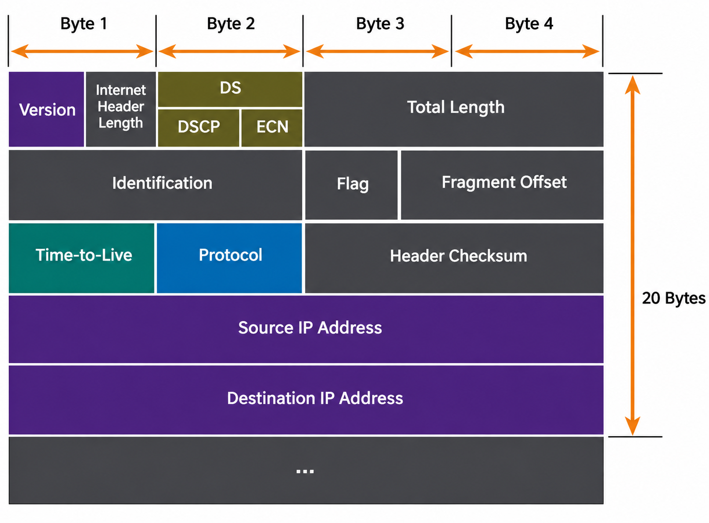

# 08 - IPv4

### مقدمة عن بروتوكول `IPv4` وهيكلية العنوان

يعتبر `IPv4` (اختصار لـ `Internet Protocol version 4`) البروتوكول الأساسي المسؤول عن إسناد الـ `Logical Addresses` للأجهزة وتوجيه البيانات (`Routing`) داخل طبقة `Network Layer`

* يتكون عنوان `IPv4` الإجمالي من **32-bit**
* يُكتب العنوان بطريقة `Dotted Decimal Notation`
* ينقسم العنوان إلى 4 خانات، تسمى كل خانة `Octet`، وكل `Octet` يحتوي على **8-bit**
* كل `Octet` يمثل قيمة تتراوح بين **0** إلى **255**، مما يعطي إجمالي $2^8 = 256$ احتمالاً لكل خانة
* يتكون العنوان منطقياً من جزأين رئيسيين:
  * **معرف الشبكة (`Network ID`)**: يُحدد رقم الشبكة التي ينتمي إليها الجهاز
  * **معرف الجهاز (`Host ID`)**: يُحدد رقم الجهاز الفريد داخل تلك الشبكة

---

### التحويل الرياضي بين النظام العشري والثنائي (`Decimal to Binary Conversion`)

للتعامل مع عناوين `IPv4` وفهم الـ `Subnetting`، يتم تحويل كل `Octet` مكون من 8 بت اعتماداً على مضاعفات الرقم 2 وقيم الأوزان لكل خانة ثنائية:

$$128 \quad 64 \quad 32 \quad 16 \quad 8 \quad 4 \quad 2 \quad 1$$

خطوات تحويل رقم عشري (مثال: الرقم 100) إلى النظام الثنائي:

1. نقارن الرقم 100 بالخانة الأكبر من جهة اليسار (128): بما أن $100 < 128$، نضع القيمة **0**
2. ننتقل للخانة التالية (64): بما أن $100 \ge 64$، نضع القيمة **1** ونطرح: $100 - 64 = 36$
3. نقارن المتبقي (36) بالخانة (32): بما أن $36 \ge 32$، نضع القيمة **1** ونطرح: $36 - 32 = 4$
4. نقارن المتبقي (4) بالخانة (16): أصغر، نضع القيمة **0**
5. نقارن المتبقي (4) بالخانة (8): أصغر، نضع القيمة **0**
6. نقارن المتبقي (4) بالخانة (4): يساويها، نضع القيمة **1** ونطرح: $4 - 4 = 0$
7. نضع **0** في الخانات المتبقية (2 و 1)
8. الناتج النهائي لتمثيل 100 هو: `01100100`

---

### فئات العناوين في `IPv4` (`Classful Addressing`)

تم تصنيف العناوين تاريخياً عبر منظمة `IANA` إلى خمس فئات أساسية (`Classes`) بناءً على قيم الـ `Fixed Bits` الأولى من جهة اليسار:

<table border="1" cellpadding="8" cellspacing="0" width="100%">
  <thead>
    <tr bgcolor="#161b22">
      <th align="center">Class</th>
      <th align="center">Fixed Bits</th>
      <th align="center">First IP</th>
      <th align="center">Last IP</th>
      <th align="center">Default Subnet Mask</th>
      <th align="left">Application & Purpose</th>
    </tr>
  </thead>
  <tbody>
    <tr>
      <td align="center"><strong><code>Class A</code></strong></td>
      <td align="center"><code>0</code></td>
      <td align="center"><code>1.0.0.0</code></td>
      <td align="center"><code>127.255.255.255</code></td>
      <td align="center"><code>255.0.0.0</code> (<code>/8</code>)</td>
      <td align="left">الشبكات الضخمة (<code>Large Networks</code>) مع عدد هائل من الـ <code>Hosts</code></td>
    </tr>
    <tr>
      <td align="center"><strong><code>Class B</code></strong></td>
      <td align="center"><code>10</code></td>
      <td align="center"><code>128.0.0.0</code></td>
      <td align="center"><code>191.255.255.255</code></td>
      <td align="center"><code>255.255.0.0</code> (<code>/16</code>)</td>
      <td align="left">الشبكات متوسطة الحجم (<code>Medium Networks</code>)</td>
    </tr>
    <tr>
      <td align="center"><strong><code>Class C</code></strong></td>
      <td align="center"><code>110</code></td>
      <td align="center"><code>192.0.0.0</code></td>
      <td align="center"><code>223.255.255.255</code></td>
      <td align="center"><code>255.255.255.0</code> (<code>/24</code>)</td>
      <td align="left">الشبكات المحلية الصغيرة (<code>Small LANs</code>)</td>
    </tr>
    <tr>
      <td align="center"><strong><code>Class D</code></strong></td>
      <td align="center"><code>1110</code></td>
      <td align="center"><code>224.0.0.0</code></td>
      <td align="center"><code>239.255.255.255</code></td>
      <td align="center">لا يوجد (<code>No Mask</code>)</td>
      <td align="left">محجوز لإرسال البث الجماعي (<code>Multicast</code>)</td>
    </tr>
    <tr>
      <td align="center"><strong><code>Class E</code></strong></td>
      <td align="center"><code>1111</code></td>
      <td align="center"><code>240.0.0.0</code></td>
      <td align="center"><code>255.255.255.255</code></td>
      <td align="center">لا يوجد (<code>No Mask</code>)</td>
      <td align="left">محجوز للأبحاث والتجارب المعملية (<code>Research & Experimental</code>)</td>
    </tr>
  </tbody>
</table>

* لحساب عدد الـ `Networks` المتاحة في أي فئة نستخدم القانون:
  $$2^{(\text{Network Bits} - \text{Fixed Bits})}$$
* لحساب عدد الـ `Hosts` المتاحة لكل شبكة نستخدم القانون:
  $$2^H - 2$$
  *(حيث تمثل $H$ عدد البتات المخصصة للـ `Host`، ونطرح دائماً 2 لأن أول عنوان مخصص لـ `Network Address` وآخر عنوان مخصص لـ `Broadcast Address`)*

---

### العناوين الخاصة والنطاقات المحجوزة (`Private IP & Special Ranges`)

لمنع استنزاف العناوين العامة، خصصت منظمة `IANA` نطاقات محددة للاستخدام الداخلي فقط داخل شبكات الـ `LAN` المحلية ولا يتم تمريرها على الإنترنت (`Non-Routable on Internet`)

<table border="1" cellpadding="8" cellspacing="0" width="100%">
  <thead>
    <tr bgcolor="#161b22">
      <th align="center">Feature</th>
      <th align="center">Public IP</th>
      <th align="center">Private IP</th>
    </tr>
  </thead>
  <tbody>
    <tr>
      <td align="center"><strong>النطاق والتواجد</strong></td>
      <td align="center">فريدة عالمياً على مستوى الإنترنت (<code>Globally Unique</code>)</td>
      <td align="center">تتكرر داخل شبكات <code>LAN</code> مختلفة دون تعارض</td>
    </tr>
    <tr>
      <td align="center"><strong>التوجيه (<code>Routing</code>)</strong></td>
      <td align="center">قابلة للتوجيه مباشرة عبر مزودي الخدمة (<code>Internet Routable</code>)</td>
      <td align="center">غير قابلة للتوجيه عبر راوترات الإنترنت وتتطلب استخدام <code>NAT</code></td>
    </tr>
    <tr>
      <td align="center"><strong>التكلفة</strong></td>
      <td align="center">مدفوعة ويتم الحصول عليها من مزود الخدمة <code>ISP</code></td>
      <td align="center">مجانية للاستخدام الداخلي في أي مؤسسة أو شبكة منزلية</td>
    </tr>
  </tbody>
</table>

* نطاقات العناوين الخاصة (`Private IP Ranges`):
  * **`Class A`**: من `10.0.0.0` إلى `10.255.255.255`
  * **`Class B`**: من `172.16.0.0` إلى `172.31.255.255`
  * **`Class C`**: من `192.168.0.0` إلى `192.168.255.255`

* نطاقات محجوزة لوظائف محددة (`Special Addresses`):
  * **`Loopback Address` (`127.0.0.0/8`)**: يستخدم النطاق من `127.0.0.1` إلى `127.255.255.255` لاختبار سلامة حزمة بروتوكولات `TCP/IP` وكارت الشبكة `NIC` داخلياً على الجهاز
  * **`APIPA` (`Automatic Private IP Addressing`)**: النطاق من `169.254.0.1` إلى `169.254.255.254` بقناع `/16`، يُسند ذاتياً للجهاز عند فشل الوصول إلى سيرفر `DHCP`
  * **البث العام (`General Broadcast`)**: العنوان `255.255.255.255` يُستخدم لإرسال البيانات لجميع الأجهزة داخل نفس نطاق الشبكة المحلي

---

### فحص الاتصال عبر أداة `Ping` واستجاباتها

يعتمد أمر `Ping` على بروتوكول `ICMP` للتحقق من الاتصال بين جهازين:

* صيغ الأمر الشائعة:
  * `ping [IP Address] -t`: استمرار الإرسال بشكل متواصل دون توقف حتى الضغط على `Ctrl+C`
  * `ping -n [number] [IP Address]`: تحديد عدد حزم الـ `Echo Requests` المرسلة
  * `ping 127.0.0.1`: اختبار داخلي لسلامة تثبيت `TCP/IP Suite` داخل نظام التشغيل وعمل كارت الشبكة

* دلالات الاستجابة:
  * **`Reply from [IP]`**: الهدف متاح ويستجيب بنجاح
  * **`Destination Host Unreachable`**: الراوتر أو الجهاز المحلي لا يجد مساراً للوصول إلى شبكة الوجهة، أو كارت الشبكة مفصول
  * **`Request Timed Out`**: الحزم أُرسلت ولكن لم يتم تلقي رد خلال المهلة الزمنية؛ إما بسبب إغلاق الجهاز، أو وجود جدار حماية (`Firewall`) يحظر حزم `ICMP Echo`

---

### تقسيم الشبكات الثابت (`FLSM - Fixed Length Subnet Mask`)

تُستخدم تقنية `Subnetting` للحد من إهدار العناوين وتقسيم شبكة رئيسية واحدة إلى شبكات فرعية أصغر متساوية الحجم:

1. تحديد عدد الـ `Hosts` المطلوبة في كل شبكة فرعية ($x$)
2. تطبيق المعادلة الرياضية لمعرفة عدد بتات المضيف المستعارة:
   $$2^n - 2 \ge x$$
3. حساب الـ `New Subnet Mask`: طرح عدد بتات الـ `Host` المتبقية ($n$) من 32 للحصول على الـ `Prefix Length` الجديد
4. حساب حجم القفزة (`Block Size`):
   $$\text{Block Size} = 256 - \text{Subnet Mask Octet Value} = 2^n$$
5. استخراج النطاقات لكل شبكة فرعية بدءاً من الـ `Network Address`، مروراً بنطاق الـ `Usable IP Range`، وحتى الـ `Broadcast Address`

---

### تقسيم الشبكات متغير الطول (`VLSM - Variable Length Subnet Mask`)

تتيح تقنية `VLSM` استخدام أقنعة `Subnet Masks` مختلفة لأجزاء مختلفة من الشبكة بناءً على الاحتياج الفعلي لكل رابط أو فرع:

* **ترتيب التوزيع**: يتم ترتيب متطلبات الشبكات دائماً **تنازلياً من الأكبر إلى الأصغر** بناءً على عدد الـ `Hosts` المطلوبة
* **توفير العناوين**: روابط الـ `Point-to-Point Links` بين الراوترات يتم تخصيص قناع `/30` لها دائماً؛ لكونه يوفر عنوانين صالحين للاستخدام فقط ($2^2 - 2 = 2$)
* **تدرج البادئة**: لا يتم إهدار العناوين، بل يتم تقسيم أول `Subnet Block` متبقي لحساب الشبكة الأصغر التالية

---

### تشريح بنية الـ `IPv4 Header`

يبلغ الحجم الأساسي لـ `IPv4 Header` غير متضمن الخيارات **20 Bytes**، وتتضمن الحقول التالية:

  

* **`Version`** (4 بت): يحدد إصدار البروتوكول وقيمته ثابتة وهي `0100` (أي 4)
* **`Internet Header Length - IHL`** (4 بت): يحدد طول الـ `Header` بوحدات الـ `32-bit words`؛ وأقل قيمة له هي 5 ($5 \times 4 = 20\text{ Bytes}$)
* **`Differentiated Services - DS / DSCP`** (8 بت): مسؤولة عن جودة الخدمة (`QoS`) لتحديد أولوية مرور الحزم وتنبيهات الازدحام (`ECN`)
* **`Total Length`** (16 بت): يحدد الحجم الإجمالي للـ `Packet` كاملاً (الـ `Header` + حمولة البيانات `Payload`)
* **حقول التجزئة (`Fragmentation Fields`)**:
  * **`Identification`** (16 بت): رقم موحد يربط الأجزاء الناتجة عن تفتيت حزمة واحدة لتجميعها لاحقاً
  * **`Flags`** (3 بت): تتضمن بت منع التجزئة (`DF - Don't Fragment`) وبت المزيد من الأجزاء (`MF - More Fragments`)
  * **`Fragment Offset`** (13 بت): يحدد موقع وترتيب كل جزء مجزأ داخل الـ `Packet` الأصلية
* **`Time to Live - TTL`** (8 بت): عداد لمنع دوران الحزم في حلقات مفرغة (`Routing Loops`)؛ يقل بمقدار 1 عند كل `Router`، وإذا وصل إلى الصفر تسقط الحزمة ويُرسل إشعار `ICMP Time Exceeded`
* **`Protocol`** (8 بت): يُشير إلى بروتوكول الطبقة العليا المحمول؛ مثل `ICMP` (رقم 1)، و`TCP` (رقم 6)، و`UDP` (رقم 17)
* **`Header Checksum`** (16 بت): خوارزمية للتحقق من سلامة الـ `Header` وخلوه من الأخطاء أثناء النقل
* **`Source IP Address`** (32 بت): الـ `Logical Address` للجهاز المرسل
* **`Destination IP Address`** (32 بت): الـ `Logical Address` للجهاز الهدف